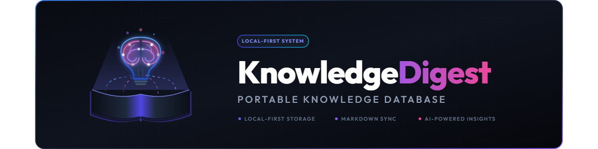
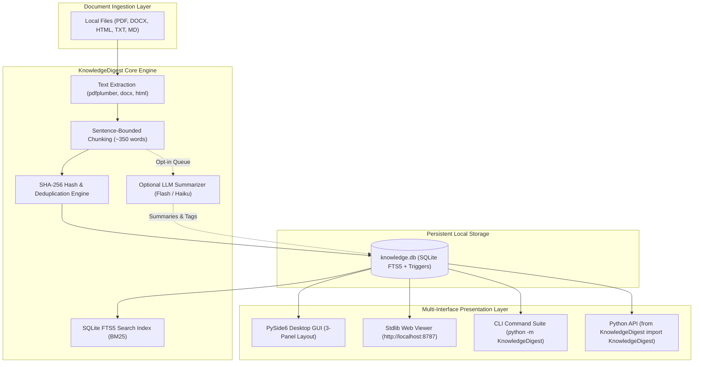
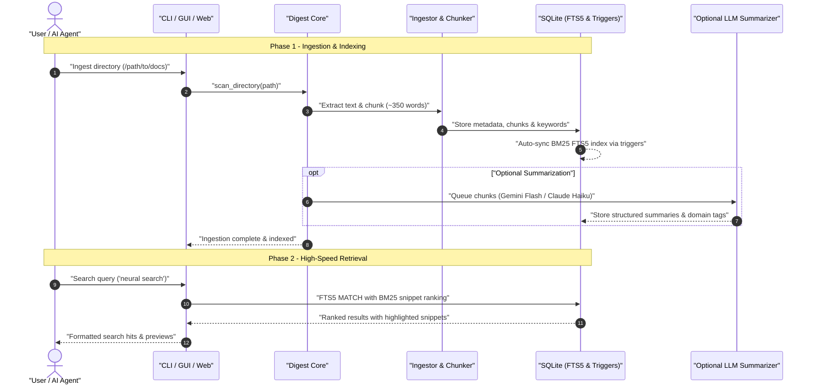

# KnowledgeDigest — Portable Local Knowledge Database

🌐 **English** | [Deutsch](README_de.md)

[](https://www.python.org/)
[](LICENSE)
[](NOTICE)
[](THIRD_PARTY_LICENSES.md)
[](CHANGELOG.md)
[](#16-testing-contract-verification)
[](#3-architecture)
[](#7-governance-invariants)
[](SECURITY.md)
[](SECURITY.md)
[](#9-desktop-gui)
[](#10-web-viewer)
[](#14-optional-integrations-ecosystem)
[](MARKETING-LOG.txt)
[](https://github.com/file-bricks)
[](https://github.com/open-bricks)

> Portable, self-contained knowledge database — indexes local documents, performs sentence-bounded semantic chunking, and provides instant SQLite FTS5 full-text search with BM25 ranking. Includes a native PySide6 desktop GUI and a zero-dependency local web viewer.

> [!NOTE]
> **AI / LLM Integration & Machine-Readable Context**<br>
> Automated AI agents, LLM assistants, and code analysis tools can read [`llms.txt`](llms.txt) for project architecture, safety boundaries, high-intent search terms, and test verification entry points.

---

## 🧭 Quick Navigation

[1. Overview](#1-overview) • [2. Key Features](#2-key-features) • [3. Architecture](#3-architecture) • [4. Lifecycle](#4-lifecycle) • [5. Target Personas](#5-target-personas) • [6. Comparison Matrix](#6-comparison-matrix) • [7. Governance Invariants](#7-governance-invariants) • [8. Search Disambiguation](#8-search-disambiguation) • [9. Desktop GUI](#9-desktop-gui) • [10. Web Viewer](#10-web-viewer) • [11. Multi-Interface CLI](#11-multi-interface-cli) • [12. Python API](#12-python-api) • [13. Configuration & Paths](#13-configuration-paths) • [14. Integrations & Ecosystem](#14-integrations-ecosystem) • [15. Setup & Installation](#15-setup-installation) • [16. Testing & Verification](#16-testing-contract-verification) • [17. Level 1 SBOM](#17-level-1-sbom-third-party-licenses) • [18. Legal Disclaimer & SLA](#18-legal-disclaimer-521-bgb-security-sla)

---

<a id="1-overview"></a><a id="sec-01"></a><a id="overview"></a>
## 1. Overview

**KnowledgeDigest** is an offline-first, local Python knowledge database and search engine. It transforms unorganized document directories (PDF, Microsoft Word DOCX, HTML, Markdown, and TXT) into a structured, relational SQLite database equipped with an FTS5 full-text index and BM25 relevance ranking.

Unlike cloud-based knowledge systems that require transmitting confidential documents to remote third parties, KnowledgeDigest operates 100% locally on your machine. Persistent state is stored in a single, portable database file (`data/knowledge.db`). Zero external daemons, Docker containers, or background telemetry services are required.

---

<a id="2-key-features"></a><a id="sec-02"></a><a id="key-features"></a><a id="features"></a>
## 2. Key Features

- **Local Document Parsing**: Deep text and metadata extraction from PDF (via `pdfplumber`), DOCX (`python-docx`), HTML (`beautifulsoup4`), Markdown, and plain text.
- **Sentence-Bounded Semantic Chunking**: Segments prose into ~350-word passages respecting punctuation and paragraph boundaries, eliminating disjointed mid-sentence cuts for LLM prompts.
- **SQLite FTS5 Full-Text Engine**: Instant BM25-ranked full-text search with trigger-based automatic index synchronization and snippet highlighting.
- **Dual Presentation Interfaces**:
  - **Native PySide6 Desktop GUI**: 3-panel split view with directory explorer, sortable document table, and live document preview (including in-app PDF rendering via `pypdfium2`).
  - **Stdlib Web Viewer**: Zero-dependency browser interface (`http://localhost:8787`) powered solely by Python's built-in `http.server`.
- **Optional Asynchronous LLM Summarization**: Optional batch processing for document chunks using Gemini Flash (`--flash`) or Anthropic Claude Haiku (`--haiku`), generating structured key takeaways and domain tags.
- **Cryptographic Deduplication**: SHA-256 duplicate detection with non-destructive physical quarantine into a dynamic `_Papierkorb` folder.
- **Zero-Copyleft Permissive Architecture**: Governed by the MIT License with no AGPL/GPL dependencies (Decision E08: `pypdfium2` chosen over PyMuPDF to eliminate copyleft risks).
- **Unprivileged Execution (`RunAsInvoker`)**: Runs strictly within standard user permissions without administrator elevation.

---

<a id="3-architecture"></a><a id="sec-03"></a><a id="architecture"></a>
## 3. Architecture & System Topology

The architecture cleanly decouples document ingestion, natural language processing, local relational storage, and presentation:



---

<a id="4-lifecycle"></a><a id="sec-04"></a><a id="lifecycle"></a>
## 4. Ingestion & Retrieval Lifecycle



---

<a id="5-target-personas"></a><a id="sec-05"></a><a id="target-personas"></a>
## 5. Target Personas & High-Intent SEO

KnowledgeDigest is optimized for four primary user groups:

| Persona ID & Profile | Primary Use Case & Needs | High-Intent Search Queries | KnowledgeDigest Solution |
|---|---|---|---|
| **`[PERSONA-01]` AI Engineers & Local LLM Developers** | RAG preprocessing, clean text chunking, and local context retrieval for offline agents. | `local RAG document database python`, `sentence bounded text chunker sqlite`, `offline LLM context retrieval` | Sentence-bounded chunking (~350 words), instant FTS5 BM25 retrieval, and optional Gemini Flash / Haiku batch pipelines. |
| **`[PERSONA-02]` Researchers & Knowledge Workers** | Organizing and searching massive personal collections of scientific PDFs, papers, and notes. | `offline pdf full text search python`, `portable knowledge base sqlite`, `pyside6 document search desktop` | In-app PDF rendering via `pypdfium2`, multi-format extraction, fast keyword search, and dark-theme PySide6 desktop GUI. |
| **`[PERSONA-03]` Privacy-Conscious Teams & Compliance Officers** | Searching proprietary contracts, source documentation, and financial reports with zero cloud exposure. | `zero egress document indexing`, `air gapped full text search desktop`, `privacy first document database` | 100% local execution; zero background telemetry; single portable SQLite database; unprivileged `RunAsInvoker` mode. |
| **`[PERSONA-04]` Python Developers & Automation Builders** | Embedding local search into scripts, CLI tools, or existing desktop applications. | `python fts5 document search library`, `file-bricks knowledgedigest`, `lightweight local document search engine` | Zero external database server requirements; clean Python API; rich CLI suite; standalone standard-library Web Viewer. |

---

<a id="6-comparison-matrix"></a><a id="sec-06"></a><a id="comparison-matrix"></a>
## 6. Comprehensive Comparison Matrix

Architectural comparison against common document search and knowledge management alternatives:

| Dimension / Invariant | KnowledgeDigest | Cloud SaaS (Notion AI, Glean, NotebookLM) | Heavy Vector DBs (Pinecone, Chroma, Milvus) | OS Desktop Search (Everything, Spotlight) | Ad-hoc Grep / Bash Scripts |
|---|---|---|---|---|---|
| **`INV-LOCAL-01` Local-First & Zero Egress** | ✅ **100% Local SQLite** | ❌ Full Cloud Transmission | ⚠️ Often Cloud / Remote Host | ✅ Local Machine | ✅ Local Machine |
| **`INV-SQLITE-02` SQLite FTS5 Engine** | ✅ **ACID FTS5 + BM25** | ❌ Proprietary Cloud Index | ❌ Vector Embedding Only | ⚠️ Filename / Basic Content | ❌ No Index / Linear Scan |
| **`INV-CHUNK-03` Semantic Chunking** | ✅ **~350 words (Sentence-safe)** | ⚠️ Unspecified Server Logic | ⚠️ Manual Chunking Required | ❌ No Chunking (Whole File) | ❌ Raw Grep Lines |
| **`INV-COPYLEFT-04` Zero-Copyleft MIT** | ✅ **MIT (pypdfium2 / BSD)** | ❌ Proprietary Closed SaaS | ⚠️ Varies (Some AGPL/SSPL) | ❌ Proprietary OS Tooling | ⚠️ Unlicensed Scripts |
| **`INV-RUNAS-05` Unprivileged User Space** | ✅ **`RunAsInvoker` (No root)** | ❌ Cloud Multi-tenant | ⚠️ Requires Docker / Server | ⚠️ Often Needs System Indexer | ✅ User Space |
| **`INV-DUAL-06` Dual Frontends (GUI + Web)** | ✅ **PySide6 + Stdlib Web** | ❌ Web Browser Only | ❌ CLI / API Only | ⚠️ OS Window Only | ❌ Terminal Only |
| **`INV-OPTLLM-07` Optional LLM Boundary** | ✅ **Works 100% Offline** | ❌ LLM is Mandatory | ⚠️ Requires Vector Embedder | ❌ No LLM Features | ❌ No LLM Features |
| **`INV-DEDUPE-08` Cryptographic Deduplication** | ✅ **SHA-256 + `_Papierkorb`** | ❌ Cloud Versioning Only | ❌ None | ⚠️ Duplicate File Checkers | ❌ Manual Shell Pipeline |
| **`INV-DOCS-09` 100% Bilingual Parity** | ✅ **18-Point Dual Anchors** | ⚠️ Partial Localization | ❌ English Only | ⚠️ OS Localization | ❌ None |
| **`INV-SLA-10` 48h Security SLA & § 521 BGB** | ✅ **Guaranteed 48h Response** | ⚠️ Standard Cloud Ticket | ⚠️ Community Forum | ❌ OS Vendor Queue | ❌ None |

---

<a id="7-governance-invariants"></a><a id="sec-07"></a><a id="governance-invariants"></a>
## 7. Governance & Runtime Invariants

KnowledgeDigest enforces ten architectural and runtime invariants across all modules:

| Invariant Code | Category | Principle & Implementation | Verification |
|---|---|---|---|
| **`INV-LOCAL-01`** | Privacy | **Local-First & Zero Egress**: All parsing, indexing, and SQLite operations occur locally. Zero telemetry. | `SECURITY.md`, `tests/test_core.py` |
| **`INV-SQLITE-02`** | Storage | **SQLite FTS5 Full-Text Engine**: Embedded ACID persistence in `data/knowledge.db` with BM25 ranking and triggers. | `KnowledgeDigest/schema.py` |
| **`INV-CHUNK-03`** | NLP | **Sentence-Bounded Semantic Chunking**: Text segmentation into ~350-word chunks without mid-sentence chops. | `KnowledgeDigest/chunker.py` |
| **`INV-COPYLEFT-04`** | Licensing | **Zero-Copyleft Isolation Guarantee**: Permissive MIT distribution. `pypdfium2` chosen over PyMuPDF (`fitz`) per E08. | `tests/test_no_agpl.py` |
| **`INV-RUNAS-05`** | Security | **Unprivileged Execution (`RunAsInvoker`)**: Executes strictly in user space; no administrative elevation needed. | `SECURITY.md` |
| **`INV-DUAL-06`** | Interface | **Dual Frontends**: PySide6 Desktop GUI (3-panel) + Python stdlib zero-dependency Web Viewer (`localhost:8787`). | `KnowledgeDigest/gui/`, `web_viewer.py` |
| **`INV-OPTLLM-07`** | Autonomy | **Optional LLM Boundary**: Search and indexing work completely without LLM; optional Gemini Flash / Haiku queues. | `KnowledgeDigest/summarizer.py` |
| **`INV-DEDUPE-08`** | Integrity | **Cryptographic Deduplication**: SHA-256 document hashing with safe physical quarantine into `_Papierkorb`. | `KnowledgeDigest/digest.py` |
| **`INV-DOCS-09`** | Documentation | **18-Point Bilingual Parity**: Mutual reciprocal anchor alignment between English and German documentation. | `tests/test_metadata.py` |
| **`INV-SLA-10`** | Governance | **Statutory Disclaimer & 48h Security SLA**: § 521 BGB unremunerated gift rules with 48h initial response SLA. | `SECURITY.md`, `README.md` |

---

<a id="8-search-disambiguation"></a><a id="sec-08"></a><a id="search-disambiguation"></a>
## 8. Search & Disambiguation

KnowledgeDigest is a **local-first portable document knowledge database and FTS5 search engine**. It is intentionally distinct from:

- **Cloud Team Wikis & SaaS Workspaces**: We are not Notion, Confluence, or Google Drive. Your data never touches a remote server.
- **Hosted Vector Databases**: We do not require cloud embeddings, vector cluster subscriptions (Pinecone, Weaviate), or GPU infrastructure.
- **Invasive OS Background Indexers**: We do not index your entire operating system, hidden system caches, or system registry in the background.
- **File Converters or DRM Removers**: We extract clean text and structure for indexing and search, not for file format conversion or DRM cracking.

### High-Intent Search Phrases:
```
KnowledgeDigest file-bricks
portable knowledge database Python
local document search FTS5 SQLite
PySide6 document search desktop app
sentence bounded text chunking python
offline document search tool
zero egress document indexing
sqlite fts5 bm25 full text search
local first ai rag database
```

---

<a id="9-desktop-gui"></a><a id="sec-09"></a><a id="desktop-gui"></a>
## 9. Desktop GUI

KnowledgeDigest features a native **PySide6** desktop interface with a modern dark theme and a responsive 3-panel layout:

| Panel | Content & Capabilities |
|---|---|
| **Left Panel** | Indexed directories explorer with document counters and instant directory scanning. |
| **Center Panel** | Document table with sortable columns (filename, type, size, chunk count, index timestamp) and real-time query filter. |
| **Right Panel** | Live document preview supporting raw text, formatted markdown, and native PDF rendering via `pypdfium2`. |

Launch the desktop GUI:
```bash
python -m KnowledgeDigest --gui
```

---

<a id="10-web-viewer"></a><a id="sec-10"></a><a id="web-viewer"></a>
## 10. Web Viewer

KnowledgeDigest provides a standalone, zero-dependency browser interface built exclusively with the Python standard library (`http.server`):

- **Dashboard**: Overview of document volume, chunk counts, and indexing health.
- **Browse & Filter**: Document catalog with responsive pagination and category filtering.
- **FTS5 Full-Text Search**: Instant search with snippet highlighting and BM25 relevance ordering.
- **Summary Explorer**: Catalog of optional LLM-generated summaries and domain keywords.
- **Hardened Security**: Enforces HTTP POST for state-changing endpoints, Origin/Referer validation, and strict Host header checks.

Launch the web viewer on `http://localhost:8787`:
```bash
python -m KnowledgeDigest --web
```

---

<a id="11-multi-interface-cli"></a><a id="sec-11"></a><a id="multi-interface-cli"></a>
## 11. Multi-Interface Access & CLI

KnowledgeDigest includes a full command-line suite:

```bash
# Display database status, document counts, and chunk statistics
python -m KnowledgeDigest status

# Add a directory to the index
python -m KnowledgeDigest add /path/to/documents

# Scan and index all registered directories
python -m KnowledgeDigest scan

# Search across all indexed documents with snippet output
python -m KnowledgeDigest search "machine learning" --limit 10

# Scan for cryptographic duplicates and quarantine them
python -m KnowledgeDigest deduplicate --quarantine

# Run optional LLM summarization on pending chunks
python -m KnowledgeDigest summarize --flash
```

---

<a id="12-python-api"></a><a id="sec-12"></a><a id="python-api"></a>
## 12. Python API

KnowledgeDigest can be imported directly as an embedded Python library:

```python
from KnowledgeDigest import KnowledgeDigest
from KnowledgeDigest.config import get_config

# Initialize engine with configuration
kd = KnowledgeDigest(config=get_config())

# Register and scan document directory
kd.add_directory("/path/to/docs")
kd.scan_directory("/path/to/docs", recursive=True)

# Perform BM25 full-text search
results = kd.search_all("transformer architecture", limit=5)
for hit in results:
    print(f"[{hit['filename']}] Score: {hit.get('rank', 'N/A')}")
    print(f"Snippet: {hit['snippet']}\n")

# Retrieve system health and index metrics
status = kd.get_status()
print(f"Indexed documents: {status['documents']['total_documents']}")
print(f"Total chunks: {status['documents']['total_chunks']}")
```

---

<a id="13-configuration-paths"></a><a id="sec-13"></a><a id="configuration-paths"></a>
## 13. Configuration & Paths

KnowledgeDigest loads configuration from `knowledgedigest.json` using the following fallback order:

1. Path specified via `--config <path>` CLI flag
2. Current working directory (`./knowledgedigest.json`)
3. Directory adjacent to the active database file
4. User application data directory:
   - Windows: `%APPDATA%\KnowledgeDigest\knowledgedigest.json`
   - Linux / macOS: `~/.config/knowledgedigest/knowledgedigest.json`
5. Built-in defaults

### Key Configuration Settings:
| Setting | Type | Default | Description |
|---|---|---|---|
| `db_path` | `str` | `"data/knowledge.db"` | Relational database location. |
| `indexed_directories` | `list[str]` | `[]` | List of root paths to monitor and index. |
| `chunk_size` | `int` | `350` | Target word count per sentence-bounded chunk. |
| `web_port` | `int` | `8787` | Port for the stdlib Web Viewer. |
| `bach_enabled` | `bool` | `false` | Optional BACH agent system bridge. |

---

<a id="14-optional-integrations-ecosystem"></a><a id="sec-14"></a><a id="optional-integrations-ecosystem"></a>
## 14. Optional Integrations & Ecosystem

- **Ecosystem Umbrella**: KnowledgeDigest is developed under the [`file-bricks`](https://github.com/file-bricks) organization and forms part of the broader [`open-bricks`](https://github.com/open-bricks) open-source software ecosystem.
- **Sister Project [ProFiler](https://github.com/file-bricks/ProFiler)**: For advanced file management, PDF redaction, OCR, and clipboard guarding, see ProFiler (AGPL-3.0).
- **Dataset Seed [WikiStub-Seed](https://github.com/dev-bricks/WikiStub-Seed)**: 630 multilingual stub articles across 12 domains, serving as an ideal corpus for testing KnowledgeDigest indexing pipelines.
- **Optional BACH Agent Bridge**: Can index skills and wiki articles from the [BACH](https://github.com/ellmos-ai/bach) agent framework when `bach_enabled: true`.

---

<a id="15-setup-installation"></a><a id="sec-15"></a><a id="setup-installation"></a>
## 15. Setup & Installation

### Option A: Editable Local Clone (Recommended)
```bash
git clone https://github.com/file-bricks/knowledgedigest.git
cd knowledgedigest
python -m pip install --upgrade pip
python -m pip install -e ".[all]"
```

### Option B: Direct Git Install
```bash
pip install "knowledgedigest[gui] @ git+https://github.com/file-bricks/knowledgedigest.git"
```

---

<a id="16-testing-contract-verification"></a><a id="sec-16"></a><a id="testing-contract-verification"></a>
## 16. Testing & Contract Verification

KnowledgeDigest includes a comprehensive automated test suite covering core chunking, SQLite FTS5 persistence, transit synchronization, zero-copyleft guarantees, and metadata contract compliance:

```bash
# Run full test suite
pytest

# Run tests with verbose output
pytest -v

# Run zero-copyleft and AGPL compliance check
pytest tests/test_no_agpl.py

# Run PEP 621 metadata, banner, and navigation contract tests
pytest tests/test_metadata.py
```

---

<a id="17-level-1-sbom-third-party-licenses"></a><a id="sec-17"></a><a id="level-1-sbom-third-party-licenses"></a>
## 17. Level 1 SBOM & Third-Party Licenses

All direct runtime dependencies are documented in our Level 1 Software Bill of Materials ([`THIRD_PARTY_LICENSES.md`](THIRD_PARTY_LICENSES.md)).

- **100% Permissive Open Source**: MIT, Apache-2.0, BSD-3-Clause, PSFL-2.0, LGPL-3.0 (dynamically linked).
- **Zero-Copyleft Isolation**: In accordance with Decision E08 (2026-08-18), `pypdfium2` is utilized for PDF rendering to ensure complete isolation from AGPL copyleft licenses.
- **Canonical Attribution**: See [`NOTICE`](NOTICE) for author and copyright attribution.

---

<a id="18-legal-disclaimer-521-bgb-security-sla"></a><a id="sec-18"></a><a id="legal-disclaimer-521-bgb-security-sla"></a>
## 18. Legal Disclaimer, § 521 BGB & Security SLA

### ⚠️ Kein Rechts-, Steuer- oder Anlage-Rat / No Professional Advice
KnowledgeDigest is a **technical software tool** for document indexing and local full-text search. It does not provide professional legal, tax, financial, or compliance advice. Consult qualified professionals for specific advisory needs.

### ⚖️ Haftungsausschluss (§ 521 BGB) / Statutory Disclaimer
Dieses Softwareprojekt wird als **unentgeltliche Open-Source-Schenkung** bereitgestellt. Gemäß **§ 521 BGB** (Gefälligkeitsrecht) ist die Haftung des Urhebers und der Mitwirkenden auf **Vorsatz und grobe Fahrlässigkeit** beschränkt. Ergänzend gelten die Bedingungen der [MIT-Lizenz](LICENSE).

### 🛡️ Security Response SLA
Security vulnerabilities should be reported confidentially via [GitHub Private Vulnerability Reporting](https://github.com/file-bricks/knowledgedigest/security/advisories/new).
- **Initial Response**: Within **48 hours**.
- **Triage & Evaluation**: Within **5 business days**.
- Details in [`SECURITY.md`](SECURITY.md).

---

### Author & Copyright
Copyright (c) 2026 Lukas Geiger ([github.com/lukisch](https://github.com/lukisch)).<br>
Part of the [`file-bricks`](https://github.com/file-bricks) organization and the [`open-bricks`](https://github.com/open-bricks) ecosystem.
