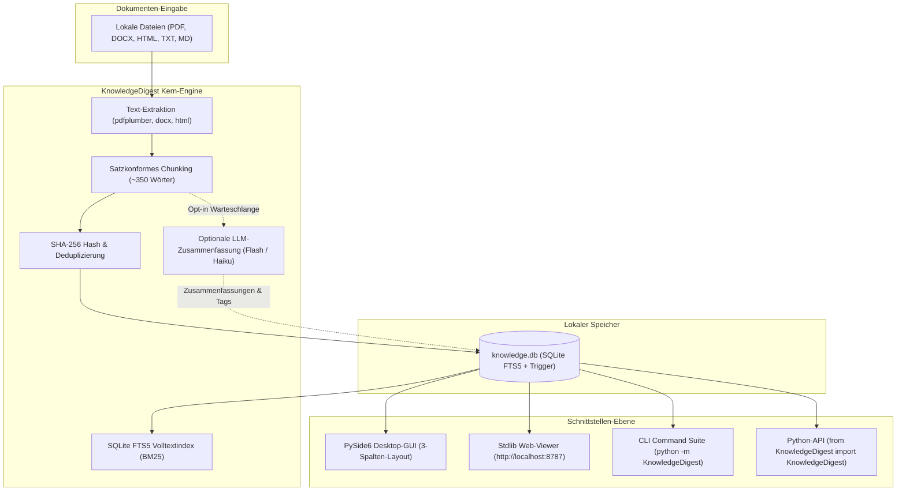
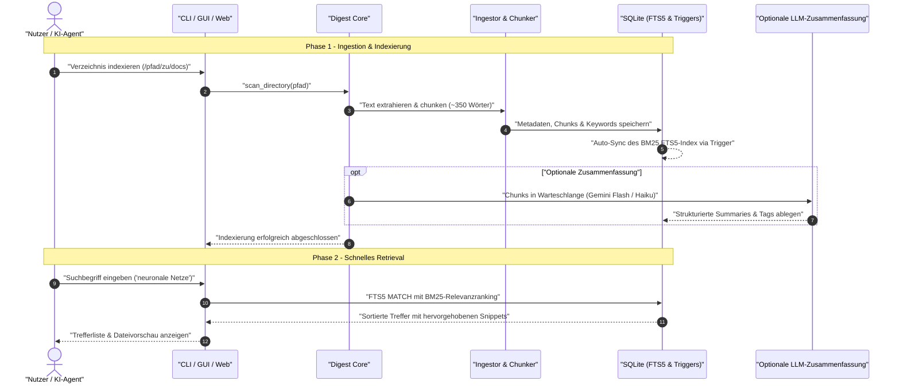

# KnowledgeDigest — Portable Lokale Wissensdatenbank

[English](README.md) | 🌐 **Deutsch**

[](https://www.python.org/)
[](LICENSE)
[](NOTICE)
[](THIRD_PARTY_LICENSES.md)
[](CHANGELOG.md)
[](#16-testing-contract-verification)
[](#3-architecture)
[](#7-governance-invariants)
[](SECURITY.md)
[](SECURITY.md)
[](#9-desktop-gui)
[](#10-web-viewer)
[](#14-optional-integrations-ecosystem)
[](MARKETING-LOG.txt)
[](https://github.com/file-bricks)
[](https://github.com/open-bricks)

> Portable, in sich geschlossene Wissensdatenbank — indexiert lokale Dokumente, führt satzkonformes semantisches Chunking durch und ermöglicht blitzschnelle SQLite FTS5-Volltextsuche mit BM25-Relevanzranking. Enthält eine native PySide6 Desktop-GUI und einen abhängigkeitsfreien Web-Viewer.

> [!NOTE]
> **KI- / LLM-Integration & Maschinenlesbarer Kontext**<br>
> Automatisierte KI-Agenten, LLM-Assistenten und Code-Analyse-Werkzeuge können [`llms.txt`](llms.txt) für Projektarchitektur, Sicherheitsgrenzen, Suchbegriffe und Verifikationseinstiege heranziehen.

---

## 🧭 Schnellnavigation

[1. Übersicht](#1-overview) • [2. Kernfunktionen](#2-key-features) • [3. Architektur](#3-architecture) • [4. Lebenszyklus](#4-lifecycle) • [5. Ziel-Personas](#5-target-personas) • [6. Vergleichsmatrix](#6-comparison-matrix) • [7. Governance-Invarianten](#7-governance-invariants) • [8. Begriffsklärung](#8-search-disambiguation) • [9. Desktop-GUI](#9-desktop-gui) • [10. Web-Viewer](#10-web-viewer) • [11. CLI-Werkzeuge](#11-multi-interface-cli) • [12. Python-API](#12-python-api) • [13. Konfiguration & Pfade](#13-configuration-paths) • [14. Ökosystem & Verwandtes](#14-integrations-ecosystem) • [15. Installation](#15-setup-installation) • [16. Tests & Vertragssicherheit](#16-testing-contract-verification) • [17. Level 1 SBOM](#17-level-1-sbom-third-party-licenses) • [18. Haftungsausschluss & SLA](#18-legal-disclaimer-521-bgb-security-sla)

---

<a id="1-overview"></a><a id="sec-01"></a><a id="overview"></a>
## 1. Übersicht

**KnowledgeDigest** ist eine lokale, offline-fähige Wissensdatenbank und Dokumenten-Suchmaschine in Python. Sie wandelt unstrukturierte Verzeichnisse mit Dokumenten (PDF, Microsoft Word DOCX, HTML, Markdown und TXT) in eine relationale SQLite-Datenbank um, die mit einem FTS5-Volltextindex und BM25-Relevanzranking ausgestattet ist.

Im Gegensatz zu Cloud-Wissenssystemen, bei denen vertrauliche Unterlagen an externe Server übertragen werden, arbeitet KnowledgeDigest zu 100 % lokal auf Ihrer Arbeitsstation. Der gesamte Datenbestand wird in einer einzigen portablen SQLite-Datei (`data/knowledge.db`) gespeichert. Es werden weder Hintergrunddienste noch externe Datenbankserver oder Docker-Container benötigt.

---

<a id="2-key-features"></a><a id="sec-02"></a><a id="key-features"></a><a id="features"></a>
## 2. Kernfunktionen

- **Lokale Dokumentenextraktion**: Tiefgehende Text- und Metadaten-Extraktion aus PDF (`pdfplumber`), DOCX (`python-docx`), HTML (`beautifulsoup4`), Markdown und reinem Text.
- **Satzkonformes semantisches Chunking**: Unterteilt Texte in ~350 Wörter umfassende Abschnitte entlang natürlicher Satzzeichen und Absätze — verhindert sinnentstellende Schnitte mitten im Satz für LLM-Prompts.
- **SQLite FTS5 Volltextsuche**: Sofortige BM25-gerankte Volltextsuche mit Trigger-basiertem automatischem Indexabgleich und Snippet-Hervorhebung.
- **Zwei Bedienoberflächen**:
  - **Native PySide6 Desktop-GUI**: 3-Spalten-Layout mit Verzeichnis-Explorer, sortierbarer Dokumententabelle und integrierter Dokumentenvorschau (inkl. nativer PDF-Anzeige via `pypdfium2`).
  - **Stdlib Web-Viewer**: Abhängigkeitsfreie Browser-Oberfläche (`http://localhost:8787`), betrieben rein über das Python-Standardmodul `http.server`.
- **Optionale asynchrone LLM-Zusammenfassungen**: Optionale Batch-Verarbeitung für Chunks mittels Gemini Flash (`--flash`) oder Anthropic Claude Haiku (`--haiku`) zur Erzeugung strukturierter Kernaussagen und Tags.
- **Kryptografische Deduplizierung**: SHA-256 Hash-Erkennung von Duplikaten mit zerstörungsfreier physischer Quarantäne in einen dynamischen `_Papierkorb`-Ordner.
- **Permissive Zero-Copyleft-Architektur**: Unter der MIT-Lizenz stehend, frei von AGPL/GPL-Viren (Entscheidung E08: `pypdfium2` gewählt anstelle von PyMuPDF).
- **Nicht-privilegierte Ausführung (`RunAsInvoker`)**: Läuft vollständig im Standard-Benutzerkontext ohne Administratorrechte.

---

<a id="3-architecture"></a><a id="sec-03"></a><a id="architecture"></a>
## 3. Architektur & Systemtopologie

Die Architektur trennt Datenaufnahme, Textverarbeitung, lokale Speicherung und Präsentation in klar entkoppelte Schichten:



---

<a id="4-lifecycle"></a><a id="sec-04"></a><a id="lifecycle"></a>
## 4. Ingestion & Retrieval Lebenszyklus



---

<a id="5-target-personas"></a><a id="sec-05"></a><a id="target-personas"></a>
## 5. Ziel-Personas & Suchintention

KnowledgeDigest richtet sich an vier zentrale Zielgruppen:

| Persona-ID & Profil | Primärer Einsatzzweck & Bedarf | Suchphrasen (High-Intent) | KnowledgeDigest Lösung |
|---|---|---|---|
| **`[PERSONA-01]` KI-Ingenieure & Lokale LLM-Entwickler** | RAG-Vorverarbeitung, sauberes Satz-Chunking und lokale Kontextabfragen für autonome Agenten. | `local RAG document database python`, `sentence bounded text chunker sqlite`, `offline LLM context retrieval` | Satzkonformes Chunking (~350 Wörter), sofortiger FTS5 BM25-Index und optionale Gemini Flash / Haiku Pipelines. |
| **`[PERSONA-02]` Wissenschaftler & Wissensarbeiter** | Verwaltung und Recherche in umfangreichen Sammlungen von Fach-PDFs, Aufsätzen und Notizen. | `offline pdf full text search python`, `portable knowledge base sqlite`, `pyside6 document search desktop` | Integrierte PDF-Vorschau via `pypdfium2`, Unterstützung gängiger Formate, präzise Suche und Desktop-GUI mit Dark-Theme. |
| **`[PERSONA-03]` Datenschutzbeauftragte & Compliance-Teams** | Durchsuchung vertraulicher Verträge und Berichte bei vollständigem Verzicht auf Cloud-Dienste. | `zero egress document indexing`, `air gapped full text search desktop`, `privacy first document database` | 100 % lokale Ausführung; null Telemetrie; portable SQLite-Datei; unprivilegierter `RunAsInvoker`-Betrieb. |
| **`[PERSONA-04]` Python-Entwickler & Automatisierer** | Einbettung lokaler Dokumentensuche in Skripte, Desktop-Apps oder bestehende Workflows. | `python fts5 document search library`, `file-bricks knowledgedigest`, `lightweight local document search engine` | Keine externen DB-Server nötig; schlanke Python-API; vollständige CLI; standardmäßiger Web-Viewer. |

---

<a id="6-comparison-matrix"></a><a id="sec-06"></a><a id="comparison-matrix"></a>
## 6. Umfassende Vergleichsmatrix

Architektonischer Vergleich mit etablierten Dokumenten- und Wissensmanagement-Ansätzen:

| Kriterium / Invariante | KnowledgeDigest | Cloud-SaaS (Notion AI, Glean, NotebookLM) | Schwere Vektor-DBs (Pinecone, Chroma, Milvus) | OS-Desktopsuche (Everything, Spotlight) | Ad-hoc Grep / Bash-Skripte |
|---|---|---|---|---|---|
| **`INV-LOCAL-01` Local-First & Zero Egress** | ✅ **100% Lokale SQLite** | ❌ Vollständige Cloud-Übertragung | ⚠️ Oft Cloud-/Remote-Dienst | ✅ Lokale Arbeitsstation | ✅ Lokale Arbeitsstation |
| **`INV-SQLITE-02` SQLite FTS5 Volltext** | ✅ **ACID FTS5 + BM25** | ❌ Proprietärer Cloud-Index | ❌ Nur Vektor-Embeddings | ⚠️ Dateinamen / Basis-Inhalt | ❌ Kein Index / Linearer Scan |
| **`INV-CHUNK-03` Satzkonformes Chunking** | ✅ **~350 Wörter (Satzgrenzen)** | ⚠️ Intransparente Server-Logik | ⚠️ Manuelles Chunking nötig | ❌ Keine Chunks (Ganze Datei) | ❌ Rohe Zeilentreffer |
| **`INV-COPYLEFT-04` Zero-Copyleft MIT** | ✅ **MIT (pypdfium2 / BSD)** | ❌ Proprietäre geschlossene SaaS | ⚠️ Teils AGPL / SSPL Lizenzen | ❌ Proprietäre OS-Werkzeuge | ⚠️ Nicht lizenziert |
| **`INV-RUNAS-05` Unprivilegierter Betrieb** | ✅ **`RunAsInvoker` (Kein Root)** | ❌ Multi-Tenant Cloud | ⚠️ Benötigt Server / Docker | ⚠️ Oft System-Indexdienst | ✅ Benutzerkontext |
| **`INV-DUAL-06` Zwei Oberflächen (GUI + Web)** | ✅ **PySide6 + Stdlib Web** | ❌ Nur Webbrowser | ❌ Nur CLI / API | ⚠️ Nur Betriebssystem-Fenster | ❌ Nur Terminal |
| **`INV-OPTLLM-07` Optionale LLM-Grenze** | ✅ **Funktioniert 100% Offline** | ❌ LLM zwingend erforderlich | ⚠️ Benötigt Vektor-Modelle | ❌ Keine LLM-Funktionen | ❌ Keine LLM-Funktionen |
| **`INV-DEDUPE-08` Deduplizierung** | ✅ **SHA-256 + `_Papierkorb`** | ❌ Nur Cloud-Versionierung | ❌ Keine | ⚠️ Nur Dateinamenduplikate | ❌ Manuelle Skript-Pipeline |
| **`INV-DOCS-09` 100% Zweisprachige Parität** | ✅ **18-Punkte-Dual-Anker** | ⚠️ Teils lückenhafte Übersetzung | ❌ Nur Englisch | ⚠️ Nach Systemsprache | ❌ Keine |
| **`INV-SLA-10` 48h SLA & § 521 BGB** | ✅ **Garantierte 48h Antwort** | ⚠️ Standard Cloud-Ticket | ⚠️ Nur Community-Foren | ❌ Nur OS-Supportkanäle | ❌ Keine |

---

<a id="7-governance-invariants"></a><a id="sec-07"></a><a id="governance-invariants"></a>
## 7. Governance- & Laufzeit-Invarianten

KnowledgeDigest garantiert die Einhaltung von zehn architektonischen Invarianten:

| Invariante | Kategorie | Prinzip & Technische Umsetzung | Verifikation |
|---|---|---|---|
| **`INV-LOCAL-01`** | Datenschutz | **Local-First & Zero Egress**: Sämtliche Parsings, Indexierungen und Suchanfragen laufen lokal ab. Null Telemetrie. | `SECURITY.md`, `tests/test_core.py` |
| **`INV-SQLITE-02`** | Datenbank | **SQLite FTS5 Volltext-Engine**: Robuste Persistenz in `data/knowledge.db` mit BM25-Ranking und Triggern. | `KnowledgeDigest/schema.py` |
| **`INV-CHUNK-03`** | NLP | **Satzkonformes semantisches Chunking**: Segmentierung in ~350 Wörter ohne Zerschneiden von Sätzen. | `KnowledgeDigest/chunker.py` |
| **`INV-COPYLEFT-04`** | Lizenzierung | **Zero-Copyleft-Garantie**: Freie MIT-Lizenz. `pypdfium2` anstelle von PyMuPDF (`fitz`) gemäß Beschluss E08. | `tests/test_no_agpl.py` |
| **`INV-RUNAS-05`** | Sicherheit | **Unprivilegierter Modus (`RunAsInvoker`)**: Arbeitet ausschließlich mit gewöhnlichen Benutzerrechten. | `SECURITY.md` |
| **`INV-DUAL-06`** | Schnittstelle | **Zwei Oberflächen**: PySide6 Desktop-GUI + Python-Stdlib Web-Viewer (`localhost:8787`). | `KnowledgeDigest/gui/`, `web_viewer.py` |
| **`INV-OPTLLM-07`** | Autonomie | **Optionale LLM-Grenze**: Vollständig offline nutzbar; optionale Gemini Flash / Haiku Queues. | `KnowledgeDigest/summarizer.py` |
| **`INV-DEDUPE-08`** | Datenintegrität | **Kryptografische Deduplizierung**: SHA-256 Hashprüfung mit sicherer `_Papierkorb`-Quarantäne. | `KnowledgeDigest/digest.py` |
| **`INV-DOCS-09`** | Dokumentation | **18-Punkte-Parität**: Identische Struktur und gegenseitige Ankerverweise zwischen Deutsch und Englisch. | `tests/test_metadata.py` |
| **`INV-SLA-10`** | Governance | **Haftungsausschluss & 48h-SLA**: Schenkungsrecht nach § 521 BGB mit garantierter 48-Stunden-Sicherheitsreaktion. | `SECURITY.md`, `README_de.md` |

---

<a id="8-search-disambiguation"></a><a id="sec-08"></a><a id="search-disambiguation"></a>
## 8. Begriffsklärung & Abgrenzung

KnowledgeDigest ist eine **lokale, portable Wissensdatenbank und FTS5-Volltextsitzung**. Es grenzt sich klar ab von:

- **Cloud-Team-Wikis**: Wir sind kein Notion, Confluence oder Google Workspace. Daten verlassen niemals Ihre Festplatte.
- **Gehostete Vektordatenbanken**: Wir erfordern keine Vektoreinbettungen, kein Cloud-Abo (Pinecone etc.) und keine GPU-Cluster.
- **Invasive OS-Hintergrund-Indexer**: Wir indexieren keine Systemverzeichnisse oder Registry-Schlüssel im Hintergrund.
- **Format-Konverter oder DRM-Entferner**: Der Fokus liegt rein auf Text- und Metadatenextraktion für Durchsuchbarkeit.

### Relevante Suchphrasen:
```
KnowledgeDigest file-bricks
portable Wissensdatenbank Python
lokale Dokumentensuche FTS5 SQLite
PySide6 Dokumentensuche Desktop App
satzkonformes Text Chunking Python
offline Dokumentensuche Werkzeug
Datenschutz Dokumentenindexierung
sqlite fts5 bm25 volltextsuche
```

---

<a id="9-desktop-gui"></a><a id="sec-09"></a><a id="desktop-gui"></a>
## 9. Desktop-GUI

KnowledgeDigest verfügt über eine moderne, native **PySide6** Desktop-Oberfläche mit dunklem Farbschema und 3-Spalten-Layout:

| Spalte | Inhalte & Funktionen |
|---|---|
| **Linke Spalte** | Verzeichnis-Explorer mit Anzeige der indexierten Dokumente und Sofort-Scan-Schaltfläche. |
| **Mittlere Spalte** | Dokumententabelle mit sortierbaren Spalten (Dateiname, Format, Größe, Chunks, Indexdatum) und Schnellfilter. |
| **Rechte Spalte** | Dokumentenvorschau mit Unterstützung für Text, Markdown und nativer PDF-Darstellung via `pypdfium2`. |

Desktop-GUI starten:
```bash
python -m KnowledgeDigest --gui
```

---

<a id="10-web-viewer"></a><a id="sec-10"></a><a id="web-viewer"></a>
## 10. Web-Viewer

KnowledgeDigest bietet eine leichtgewichtige Browser-Oberfläche, die ausschließlich auf der Python-Standardbibliothek basiert (`http.server`):

- **Dashboard**: Statistiken über Dokumente, Chunks und Indexierungsfortschritt.
- **Dokumentenübersicht**: Übersicht aller Dateien mit Paginierung und Verzeichnisfilter.
- **FTS5-Volltextsuche**: Schnelle Suche mit BM25-Relevanz und hervorgehobenen Textabschnitten.
- **Zusammenfassungen**: Katalog der optionalen LLM-Zusammenfassungen und Fachbegriffe.
- **Gehärtete Sicherheit**: POST-Zwang für schreibende Endpunkte, Origin-/Referer-Prüfung und Host-Header-Validierung.

Web-Viewer starten (`http://localhost:8787`):
```bash
python -m KnowledgeDigest --web
```

---

<a id="11-multi-interface-cli"></a><a id="sec-11"></a><a id="multi-interface-cli"></a>
## 11. Multi-Interface Zugriff & CLI

KnowledgeDigest bringt ein vollständiges Kommandozeilen-Interface mit:

```bash
# Status der Datenbank, Dokumentenzahl und Chunks anzeigen
python -m KnowledgeDigest status

# Neues Verzeichnis zum Index hinzufügen
python -m KnowledgeDigest add /pfad/zu/dokumenten

# Alle registrierten Verzeichnisse scannen und neu indexieren
python -m KnowledgeDigest scan

# Volltextsuche über alle Dokumente durchführen
python -m KnowledgeDigest search "maschinelles lernen" --limit 10

# Nach kryptografischen Duplikaten suchen und in Quarantäne verschieben
python -m KnowledgeDigest deduplicate --quarantine

# Optionale LLM-Zusammenfassung für offene Chunks starten
python -m KnowledgeDigest summarize --flash
```

---

<a id="12-python-api"></a><a id="sec-12"></a><a id="python-api"></a>
## 12. Python-API

KnowledgeDigest kann als Bibliothek direkt in Python-Projekte eingebunden werden:

```python
from KnowledgeDigest import KnowledgeDigest
from KnowledgeDigest.config import get_config

# Initialisierung mit Konfiguration
kd = KnowledgeDigest(config=get_config())

# Verzeichnis hinzufügen und einlesen
kd.add_directory("/pfad/zu/docs")
kd.scan_directory("/pfad/zu/docs", recursive=True)

# Volltextsuche via FTS5 und BM25
results = kd.search_all("transformer architektur", limit=5)
for hit in results:
    print(f"[{hit['filename']}] Relevanz: {hit.get('rank', 'N/A')}")
    print(f"Auszug: {hit['snippet']}\n")

# Systemstatus abfragen
status = kd.get_status()
print(f"Dokumente: {status['documents']['total_documents']}")
print(f"Chunks: {status['documents']['total_chunks']}")
```

---

<a id="13-configuration-paths"></a><a id="sec-13"></a><a id="configuration-paths"></a>
## 13. Konfiguration & Pfade

Die Konfiguration erfolgt über die JSON-Datei `knowledgedigest.json`. Suchreihenfolge:

1. CLI-Parameter `--config <pfad>`
2. Aktuelles Arbeitsverzeichnis (`./knowledgedigest.json`)
3. Neben der aktiven Datenbankdatei
4. Benutzerbezogener Konfigurationsordner:
   - Windows: `%APPDATA%\KnowledgeDigest\knowledgedigest.json`
   - Linux / macOS: `~/.config/knowledgedigest/knowledgedigest.json`
5. Eingebaute Standardwerte

### Wichtige Einstellungen:
| Parameter | Typ | Standardwert | Beschreibung |
|---|---|---|---|
| `db_path` | `str` | `"data/knowledge.db"` | Speicherort der SQLite-Datenbank. |
| `indexed_directories` | `list[str]` | `[]` | Liste der überwachten Ordner. |
| `chunk_size` | `int` | `350` | Zielgröße in Wörtern pro Textsegment. |
| `web_port` | `int` | `8787` | Port für den Web-Viewer. |
| `bach_enabled` | `bool` | `false` | Optionale Anbindung an das BACH-Framework. |

---

<a id="14-optional-integrations-ecosystem"></a><a id="sec-14"></a><a id="optional-integrations-ecosystem"></a>
## 14. Optionale Integrationen & Ökosystem

- **Ökosystem**: KnowledgeDigest wird von der Organisation [`file-bricks`](https://github.com/file-bricks) betreut und ist Teil des übergeordneten [`open-bricks`](https://github.com/open-bricks) Open-Source-Verbunds.
- **Schwesterprojekt [ProFiler](https://github.com/file-bricks/ProFiler)**: Für erweiterte Dateiverwaltung, PDF-Schwärzung, OCR und Zwischenablageschutz siehe ProFiler (AGPL-3.0).
- **Test-Korpus [WikiStub-Seed](https://github.com/dev-bricks/WikiStub-Seed)**: 630 mehrsprachige Kurzeinträge aus 12 Fachbereichen als strukturierter Test-Datensatz für Ingestion-Pipelines.
- **Optionale BACH-Brücke**: Bei aktiviertem `bach_enabled: true` können Skills und Wissensartikel aus dem [BACH](https://github.com/ellmos-ai/bach) Agenten-Framework mitindexiert werden.

---

<a id="15-setup-installation"></a><a id="sec-15"></a><a id="setup-installation"></a>
## 15. Setup & Installation

### Option A: Editierbarer lokaler Klon (Empfohlen)
```bash
git clone https://github.com/file-bricks/knowledgedigest.git
cd knowledgedigest
python -m pip install --upgrade pip
python -m pip install -e ".[all]"
```

### Option B: Direkte Installation via Git
```bash
pip install "knowledgedigest[gui] @ git+https://github.com/file-bricks/knowledgedigest.git"
```

---

<a id="16-testing-contract-verification"></a><a id="sec-16"></a><a id="testing-contract-verification"></a>
## 16. Tests & Vertragssicherheit

KnowledgeDigest enthält eine umfassende Test-Suite für Chunking-Integrität, SQLite FTS5-Persistenz, Transit-Synchronisation, Zero-Copyleft-Schutz und PEP-621-Vertragstests:

```bash
# Komplette Test-Suite ausführen
pytest

# Detaillierte Testausgabe
pytest -v

# Lizenz- und Copyleft-Vertragstest ausführen
pytest tests/test_no_agpl.py

# Metadaten- und Dokumentationsverträge prüfen
pytest tests/test_metadata.py
```

---

<a id="17-level-1-sbom-third-party-licenses"></a><a id="sec-17"></a><a id="level-1-sbom-third-party-licenses"></a>
## 17. Level 1 SBOM & Drittanbieter-Lizenzen

Alle direkten Laufzeit-Abhängigkeiten sind im Level 1 Software Bill of Materials ([`THIRD_PARTY_LICENSES.md`](THIRD_PARTY_LICENSES.md)) erfasst.

- **100 % Freie Open-Source-Lizenzen**: MIT, Apache-2.0, BSD-3-Clause, PSFL-2.0, LGPL-3.0 (dynamisch eingebunden).
- **Keine Copyleft-Kontamination**: Gemäß Entscheidung E08 (2026-08-18) wird für PDF-Vorschauen `pypdfium2` eingesetzt, um AGPL-Risiken auszuschließen.
- **Kanonische Urheber-Angaben**: Siehe [`NOTICE`](NOTICE) für Autoren und Copyright.

---

<a id="18-legal-disclaimer-521-bgb-security-sla"></a><a id="sec-18"></a><a id="legal-disclaimer-521-bgb-security-sla"></a>
## 18. Haftungsausschluss, § 521 BGB & Sicherheits-SLA

### ⚠️ Kein Rechts-, Steuer- oder Anlage-Rat
KnowledgeDigest ist ein **technisches Werkzeug** zur Dokumentenindexierung und Volltextsuche. Es stellt keine Rechts-, Steuer- oder Finanzberatung dar. Bei entsprechenden Fachfragen ziehen Sie bitte qualifizierte Experten heran.

### ⚖️ Gesetzlicher Haftungsausschluss (§ 521 BGB)
Dieses Projekt ist eine **unentgeltliche Open-Source-Schenkung** im Sinne der §§ 516 ff. BGB. Die Haftung des Urhebers ist gemäß **§ 521 BGB** (Gefälligkeitsrecht) auf **Vorsatz und grobe Fahrlässigkeit** beschränkt. Ergänzend gelten die Haftungsausschlüsse der [MIT-Lizenz](LICENSE).

### 🛡️ Sicherheits-Reaktionszeiten (SLA)
Sicherheitsrelevante Schwachstellen melden Sie bitte vertraulich über [GitHub Private Vulnerability Reporting](https://github.com/file-bricks/knowledgedigest/security/advisories/new).
- **Erste Rückmeldung**: Innerhalb von **48 Stunden**.
- **Evaluierung & Einstufung**: Innerhalb von **5 Werktagen**.
- Weitere Details in [`SECURITY.md`](SECURITY.md).

---

### Urheber & Copyright
Copyright (c) 2026 Lukas Geiger ([github.com/lukisch](https://github.com/lukisch)).<br>
Teil der Organisation [`file-bricks`](https://github.com/file-bricks) und des [`open-bricks`](https://github.com/open-bricks) Ökosystems.
